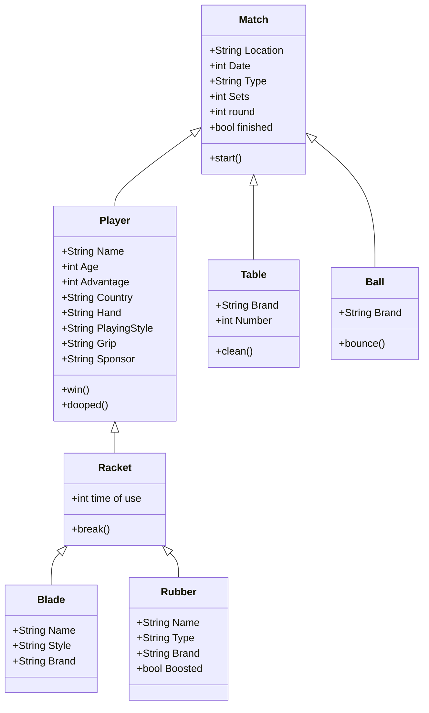

## Relación de objetos en un partido de tenis de mesa

```mermaid
classDiagram
  Match <|-- Player
  Match <|-- Table
  Player <|-- Racket
  Racket <|-- Blade
  Racket <|-- Rubber
  Match <|-- Ball

  class Match {
    +String Location
    +int Date 
    +String Type
    +int Sets
    +int round
    +bool finished
    +start()
  }

  class Table {
    +String Brand
    +int Number
    +clean()
  }

  class Player {
    +String Name
    +int Age
    +int Advantage
    +String Country
    +String Hand
    +String PlayingStyle
    +String Grip
    +String Sponsor
    +win()
    +dooped()
  }

  class Racket {
    +int time of use
    +break()
  }

  class Blade {
    +String Name
    +String Style
    +String Brand
  }

  class Rubber {
    +String Name
    +String Type
    +String Brand
    +bool Boosted

  }

  class Ball {
    +String Brand
    +bounce()
  }


```
