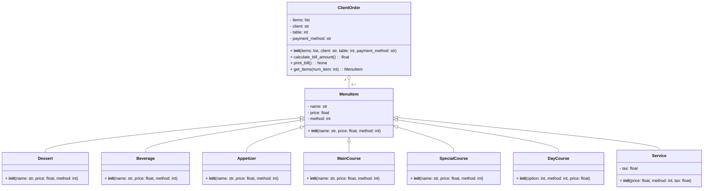

```mermaid
classDiagram
    class MenuItem {
        - name: str
        - price: float
        - method: int
        + __init__(name: str, price: float, method: int)
    }
    class Dessert {
        + __init__(name: str, price: float, method: int)
    }
    class Beverage {
        + __init__(name: str, price: float, method: int)
    }
    class Appetizer {
        + __init__(name: str, price: float, method: int)
    }
    class MainCourse {
        + __init__(name: str, price: float, method: int)
    }
    class SpecialCourse {
        + __init__(name: str, price: float, method: int)
    }
    class DayCourse {
        + __init__(option: int, method: int, price: float)
    }
    class Service {
        - tax: float
        + __init__(price: float, method: int, tax: float)
    }
    class ClientOrder {
        - items: list
        - client: str
        - table: int
        - payment_method: str
        + __init__(items: list, client: str, table: int, payment_method: str)
        + calculate_bill_amount(): float
        + print_bill(): None
        + get_items(num_item: int): MenuItem
    }
    MenuItem <|-- Dessert
    MenuItem <|-- Beverage
    MenuItem <|-- Appetizer
    MenuItem <|-- MainCourse
    MenuItem <|-- SpecialCourse
    MenuItem <|-- DayCourse
    MenuItem <|-- Service
    ClientOrder "1" o-- "0..*" MenuItem

```
